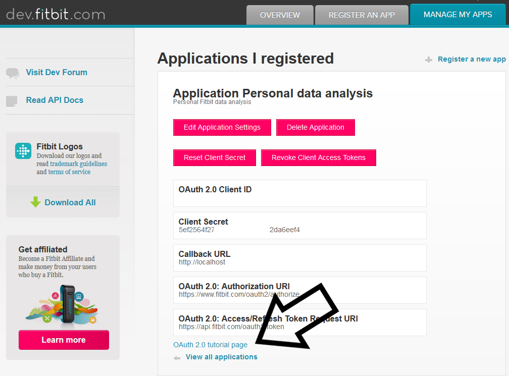

# ai-roadshow-fitbit
Fitbit data analysis for infoShare AI Roadshow

# Jak pobrać dane z Fitbit Web API?

Rejestracja nowej aplikacji na stronie [https://dev.fitbit.com/apps/new](https://dev.fitbit.com/apps/new). Ważne, żeby zaznaczyć "OAuth 2.0 Application Type" jako "Personal". Wymagane URLe mogą być dowolne, ale zaczynające się od http://, strony nie są sprawdzane przy rejestracji.

---

Po zarejestrowaniu aplikacji trzeba przejść do "OAuth 2.0 tutorial page" i tam wybrać Authorization Code Flow. Na końcu tutorial pozwala na wygenerowanie gotowych komend w curl, które można uruchomić bezpośrednio z konsoli i ich wynik przekierować do pliku. Pod Windowsem polecenia będą działały poprawnie dopiero po zamianie ' (apostrof) na " (cudzysłów).

Nie polecam korzystania z Pythonowego modułu do Web API Fitbita (python-fitbit https://pypi.org/project/fitbit/) - w momencie tworzenia prezentacji projekt nie wspierał najnowszej wersji API.